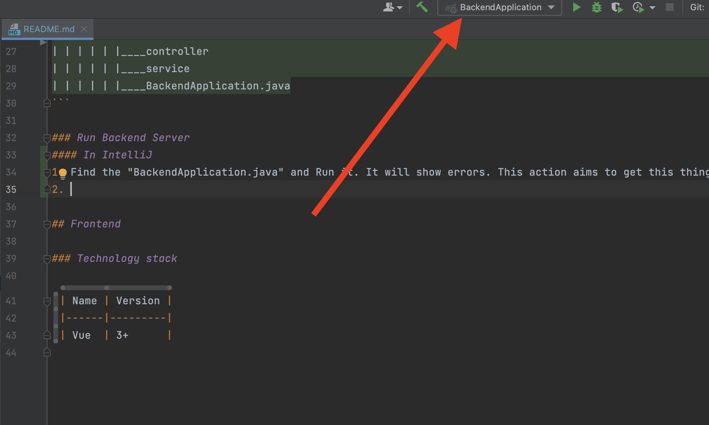
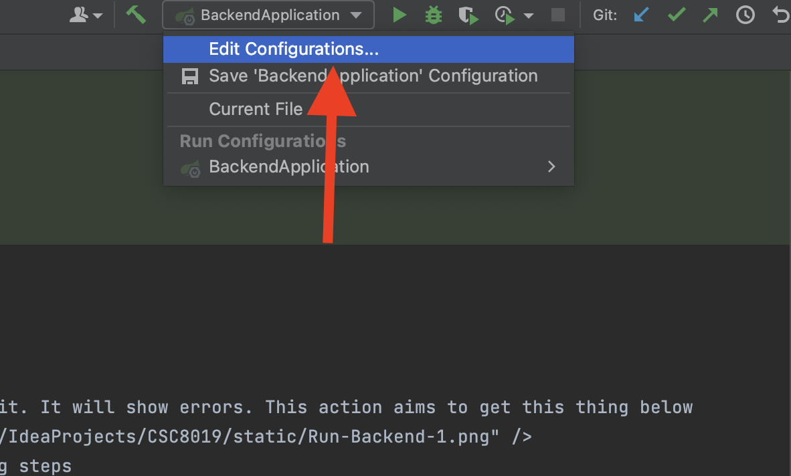
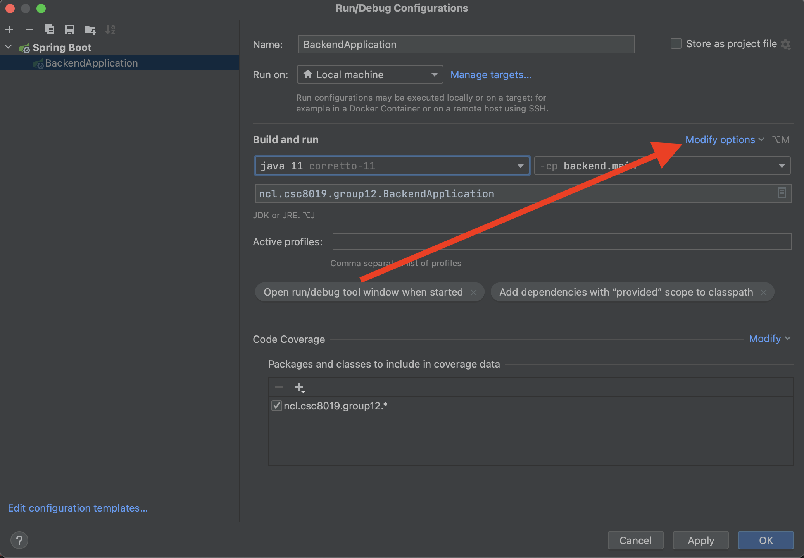
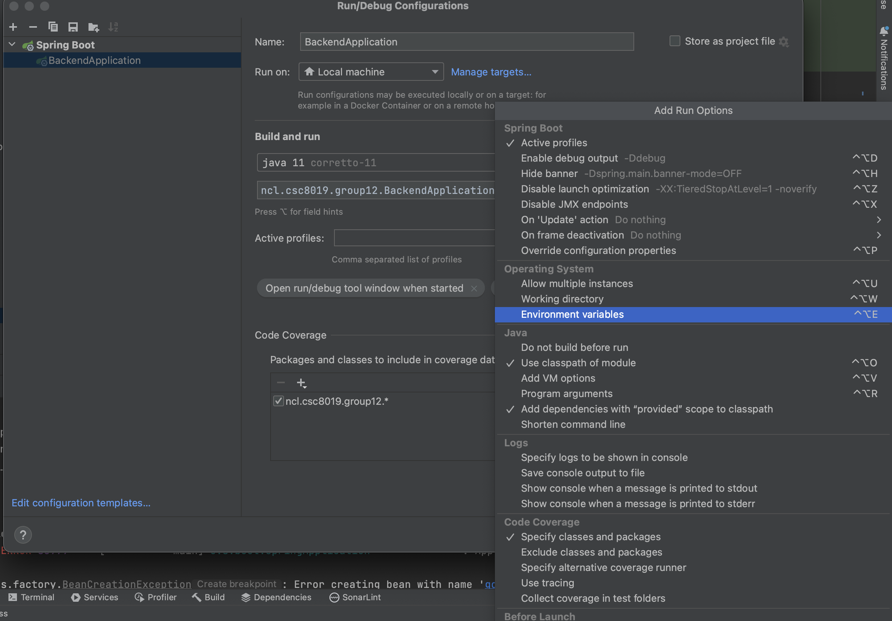
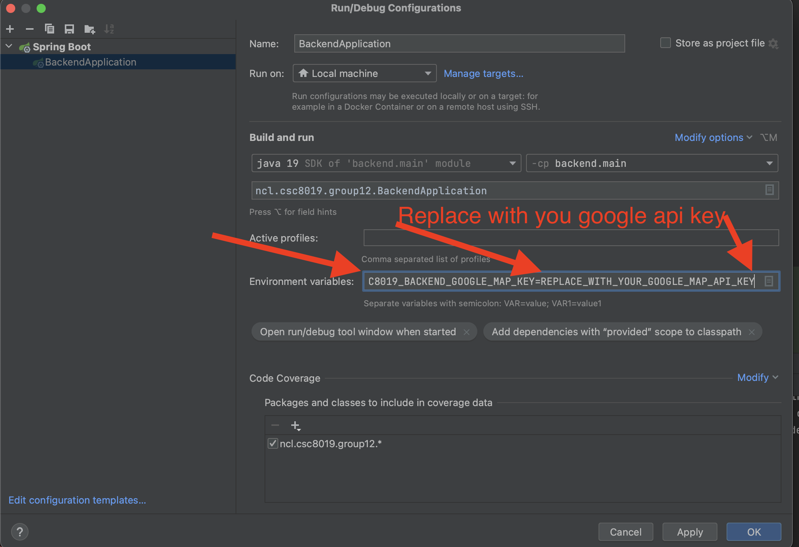

# CSC8019 Group Coursework

---
## Abstract

## Code Standard
```text
Naming convention

1. All name should try to contain more information
Bad example: method1, param1
Good example: getCarWithColor, studentName.

2. File name should be PascalCase
Bad example: usercontroller.java
Good example: UserController.java

3. Name of method, variable should be camelCase
Bad example: Params, ThisisAMeTHod
Good example for method: queryUserDataWithId
Good example for variable: studentName, locationOfUser
Good example for constants variable: USER_API_KEY

4. Try to write much information to describe the author, the purpose, the aim and return of a class, a method or a variable.

Code Quality

1. All function should be tested by unit test (normal case, exception case)
2. Try to solve problems IntelliJ tells and SonarLint tells (Please install sonarlint plugin firstly, could find in setting -> plugins)
```


## Backend

### Technology stack

| Name       | Version |
|------------|---------|
| Springboot | 2.7.9   |

### Structure

```text
src
|____test
| |____java
| | |____ncl.csc8019.group12
|____main
| |____resources
| | |____application.yaml
| |____java
| | |____ncl.csc8019.group12
| | | | | |____controller
| | | | | |____service
| | | | | |____BackendApplication.java
```

### Run Backend Server

#### With IntelliJ

1. Find the "BackendApplication.java" and Run it. It will show errors. This action aims to get this thing below.
   

2. Then set environment variable with following steps
   <br>
   
   <br>
   
   <br>
   
   <br>
   
   <br>
3. Then run this backend application again.

** The Google Map API key should have **Places API and Directions API** permissions.
** If run unit test, you should follow this steps for these configurations again.

## Frontend

### Technology stack

| Name | Version |
|------|---------|
| Vue  | 3.2.47  |

### Structure

```text
frontend
|____index.html
|____vite.config.js
|____public
| |____favicon.ico
|____package-lock.json
|____package.json
|____.env
|____src
| |____main.js
| |____App.vue
| |____assets
| |____constants
| |____components
| |____service
| |____utils
| |____views
| |____router
| | |____index.js
```

### Run Frontend Server

#### With IntelliJ

1. Make sure you have installed node.js (18.15.0 LTS or more higher) [node.js](https://nodejs.org)
2. Fill the Google map api key in [.env](./frontend/.env) VITE_GOOGLE_MAP_API_KEY, this map api key should have permission for *
   *Maps JavaScript API**
3. Run with below shell

```shell
# Get into frontend dictory
cd frontend

# Install dependency
npm install

# Run frontend
npm run dev
```
