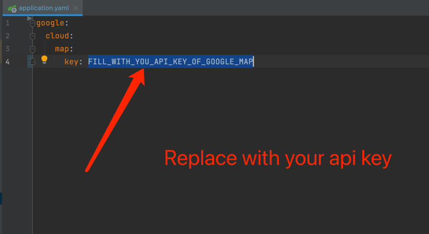
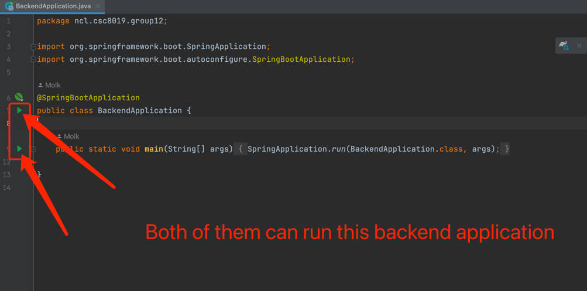

# Run Backend server

## With IntelliJ

1. Find the [application.yaml](../backend/src/main/resources/application.yaml),
   and replace "FILL_WITH_YOU_API_KEY_OF_GOOGLE_MAP" with you google api key
   

2. Then find [BackendApplication.java](../backend/src/main/java/ncl/csc8019/group12/BackendApplication.java),
   run this backend application.
   

   _This Google Map API key should have **Places API** permissions at least._