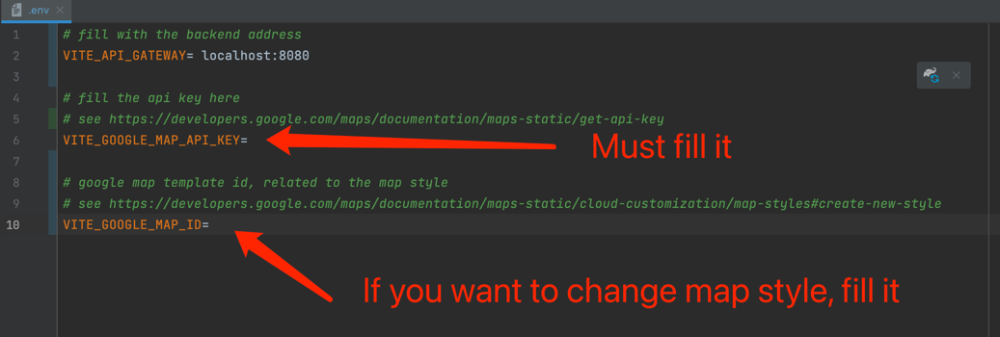

# Run Frontend server

## With IntelliJ

1. Make sure you have installed node.js (18.15.0 LTS or more higher) [node.js](https://nodejs.org)
2. Fill the Google map api key in [.env](../frontend/.env) VITE_GOOGLE_MAP_API_KEY, this map api key should have
   permission for **Maps JavaScript API**, **Places API** and **Direction API**
   
3. Run with below shell

```shell
# Get into frontend directory
cd frontend

# Install dependency
npm install

# Run frontend
npm run dev
```
